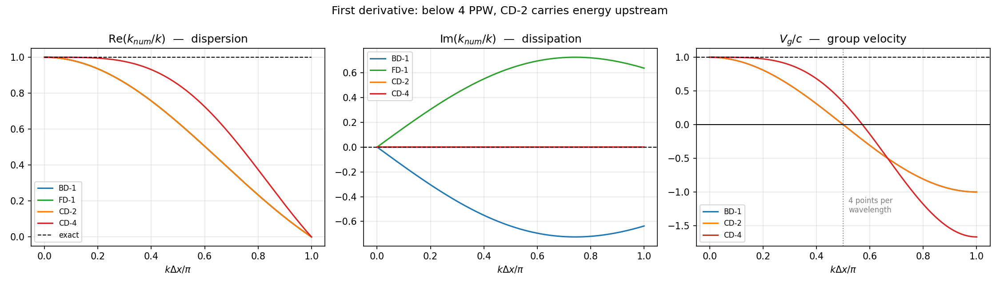
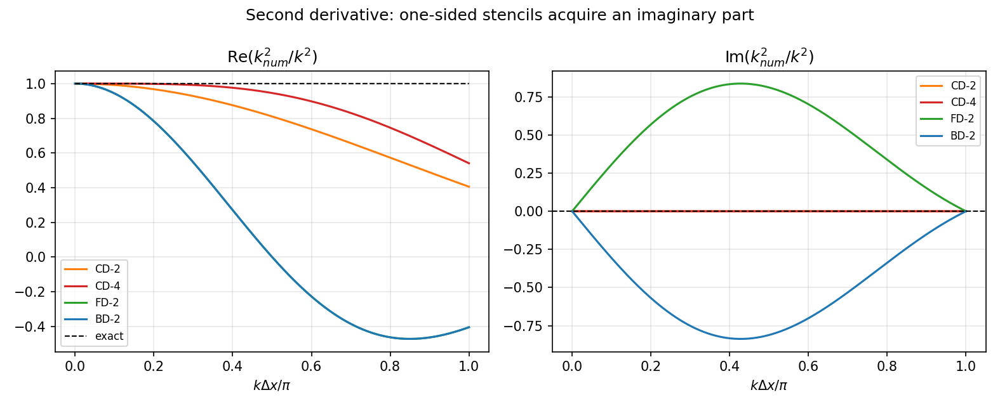

# 02 — Global spectral analysis

Modules 01 and 03–05 verify schemes by refining the grid and watching the error
fall. That is necessary and it is not sufficient. **Order of accuracy describes
the limit `Δx → 0`. It says nothing about which scheme is more accurate on the
grid you can actually afford.**

This module answers that second question: feed a single Fourier mode
`exp(ikx)` into a stencil and compare what comes back against the exact
derivative. The **numerical wavenumber** `k_num` is generally complex and
generally not equal to `k`:

```
Re(k_num/k) != 1   ->  mode travels at the wrong speed   ->  dispersion
Im(k_num/k) != 0   ->  mode grows or decays              ->  dissipation
```

Module 01 established the baseline: for the exact advection equation `|G| = 1`
and `c_p = c` for every wavenumber.

---

## Verification

Every closed form was checked by applying the stencil directly to `exp(ikx)`.
No algebra taken on trust:

| | first derivative | | | second derivative | | |
|---|---|---|---|---|---|---|
| BD-1 | 1.11e-16 | CD-2 | 1.11e-16 | CD-2 | 2.91e-14 | FD-2 | 5.13e-14 |
| FD-1 | 1.11e-16 | CD-4 | 5.66e-16 | CD-4 | 8.52e-14 | BD-2 | 6.91e-15 |

And each stencil approaches exactness as `K → 0` at its formal order — measured
from the spectral formulas, tying this module back to the Taylor derivations:

| stencil | err(K) | err(K/2) | measured `p` | formal |
|---|---|---|---|---|
| BD-1 | 5.000e-03 | 2.500e-03 | **1.00** | 1 |
| FD-1 | 5.000e-03 | 2.500e-03 | **1.00** | 1 |
| CD-2 | 1.667e-05 | 4.167e-06 | **2.00** | 2 |
| CD-4 | 3.333e-10 | 2.083e-11 | **4.00** | 4 |

---

## Three results

### Order of accuracy is not resolving power

How many points per wavelength does each stencil need for 1% phase error?

| stencil | order | PPW @ 1% | PPW @ 0.1% |
|---|---|---|---|
| BD-1 | 1 | **25.6** | 81.1 |
| FD-1 | 1 | **25.6** | 81.1 |
| CD-2 | 2 | **25.6** | 81.1 |
| CD-4 | 4 | **8.3** | 15.0 |

**BD-1 and CD-2 need exactly the same resolution** — one first order, the other
second. They share the real part `sin(K)/K`, and phase error lives entirely in
the real part. A convergence study cannot tell these two apart on this axis at
all.

CD-4 needs about a third as many points per direction — roughly 27× fewer cells
in 3D. That is the economic argument for high-order methods.

### Stability is one sign

BD-1 and FD-1 have **identical real parts** and **exactly opposite imaginary
parts**. At `K = π`: `Im(BD-1) = −0.6366`, `Im(FD-1) = +0.6366`. Same order,
same phase behaviour, opposite stability. Module 01 showed this through the
modified equation's `±ν u_xx`; here it is visible directly in the symbol.

Central stencils are **purely real at every wavenumber** — `Im = 0` exactly. So
CD-2 has no mechanism at all to control the two-point wave, which is why it
cannot be used alone for advection.

### Energy travels the wrong way

Group velocity — the speed at which a wave packet's *energy* moves — for CD-2 is
`V_g/c = cos(K)`:

| `K/π` | CD-2 | CD-4 |
|---|---|---|
| 0.10 | 0.9511 | 0.9984 |
| 0.25 | 0.7071 | 0.9428 |
| 0.50 | **0.0000** | 0.3333 |
| 0.75 | **−0.7071** | −0.9428 |
| 1.00 | **−1.0000** | −1.6667 |

**The sign changes at 4 points per wavelength.** Below that, energy propagates
*upstream* while the exact solution carries it downstream — at `K = π`, full
speed, wrong direction. These are the spurious upstream **q-waves**.

They are invisible to everything else in this repository:

- a convergence study misses them — they vanish as `Δx → 0`
- a stability analysis misses them — `|G| ≤ 1` throughout
- they show up as oscillations *ahead of* a feature, where nothing should be yet

CD-4 is better at low `K` and **worse** at high `K`, reaching `−1.67`. Higher
order is not uniformly better: it is better where you resolve and worse where
you do not.

---

## Theory

[**01 — The numerical wavenumber**](theory/01-numerical-wavenumber.md) — the
substitution derived in full for BD-1, the closed forms for all eight stencils,
dissipation versus dispersion, points per wavelength, and group velocity
including the sign change.

## Code

| File | Purpose |
|---|---|
| `experiments/first_attempt_order1.py` | Original hand-written first-derivative plots |
| `experiments/first_attempt_order2.py` | Original hand-written second-derivative plots |
| `src/spectral.py` | All eight symbols, group velocity, points per wavelength |
| `tests/test_spectral.py` | Six verification checks |

The originals are kept unchanged. Every formula in them was verified correct to
machine precision before anything was built on top.

## Figures



Dispersion (left), dissipation (centre), group velocity (right). BD-1, FD-1 and
CD-2 share a real part, so they lie on top of each other in the first panel and
separate completely in the second. The dotted line in the third panel marks
4 points per wavelength, where CD-2's group velocity changes sign.



## Running

```bash
python3 tests/test_spectral.py
python3 experiments/make_figures.py   # regenerates figures/
```

---

## Why this module matters for the rest of the repository

Module 06's cavity solver uses first-order upwind for vorticity advection. This
module is how you quantify what that costs: the numerical viscosity it
introduces, the wavenumbers it fails to resolve, and the resolution required
before a feature is represented faithfully rather than merely converged.
